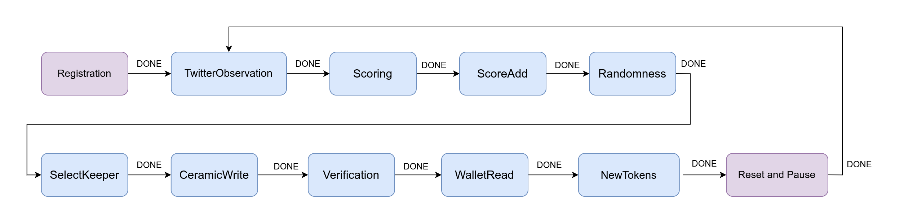

# IEKit
An autonomous service implementing a decentralized Impact Evaluator built with the [Open Autonomy](https://docs.autonolas.network/open-autonomy/) framework. The service tracks mentions to [@autonolas](https://twitter.com/autonolas) on Twitter, assigns scores to them and writes those scores to a [Ceramic](https://ceramic.network/) stream. It then reads verified wallets (a mapping between Wwitter handles and Ethereum addresses) from another Ceramic stream, checks for users that have minted a token, and updates their token metadata according to their scores so NFT images are upgraded over time.

## Architecture

Autonomous services that use Autonolas technology are implemented as [Finite State Machines](https://docs.autonolas.network/open-autonomy/key_concepts/fsm/) where the logic is split across independent components: rounds define the rules to transition across different states and behaviors, who implement the actual business logic. At the end of each round, agents agree on the round’s data output.



### Rounds

* Registration: agents are registered and share their configuration.
* TwitterObservation: agents pull data from the Twitter API. They retrieve all the tweets which mention the Autonolas user account.
* Scoring: a score is assigned to each user according to how many tweets they have contributed.
* ScoreAdd: previous scores are retrieved from a Ceramic stream and added to the new points.
* Randomness: randomness is retrieved from a VRF.
* SelectKeeper: an agent is randomly selected as keeper.
* CeramicWrite: the keeper writes the new scores to a Ceramic stream.
* Verification: all the agents verify that the keeper has successfully written to the Ceramic stream by reading it and comparing it to the expected values.
* WalletRead: verified wallets (addresses that have been linked to a Twitter handle) are read from a Ceramic stream.
* NewTokens: newly minted tokens are retrieved and total scores are associated with their corresponding token.

### Handler

* An HttpHandler handles requests made to the service. Requests like ```curl localhost:8000/1```, where 1 here is the token id, will be responded with the token metadata.

## Requirements

- Clone the repository:

      git clone git@github.com:valory-xyz/IEKit.git

- System requirements:

    - Python `>=3.7`
    - [Tendermint](https://docs.tendermint.com/v0.34/introduction/install.html) `==0.34.19`
    - [IPFS node](https://docs.ipfs.io/install/command-line/#official-distributions) `==0.6.0`
    - [Pipenv](https://pipenv.pypa.io/en/latest/install/) `>=2021.x.xx`
    - [Docker Engine](https://docs.docker.com/engine/install/)
    - [Docker Compose](https://docs.docker.com/compose/install/)

- Pull pre-built images:

      docker pull valory/autonolas-registries:latest
      docker pull valory/safe-contract-net:latest

- Create development environment:

      make new_env && pipenv shell

- Configure command line:

      autonomy init --reset --author valory --remote --ipfs --ipfs-node "/dns/registry.autonolas.tech/tcp/443/https"

- Pull packages:

      autonomy packages sync --update-packages

## Running the service

- Fetch the service from the remote registry:

      autonomy fetch --local --service valory/impact_evaluator
      cd impact_evaluator/

- Build the image

      autonomy build-image

- Export the environment variables (see ```service.yaml``` for all the available variables). These are some examples:


      ETHEREUM_LEDGER_RPC=https://goerli.infura.io/v3/<infura_api_key>
      OBSERVATION_INTERVAL=10
      DYNAMIC_CONTRIBUTION_CONTRACT_ADDRESS=0x7C3B976434faE9986050B26089649D9f63314BD8
      WALLETS_STREAM_ID=kjzl6cwe1jw147yrw3npgusw0jccfnaju8f3jrnb3swobxhh21vf8i96x6s8lh8
      SCORES_STREAM_ID=kjzl6cwe1jw145z0wz2ohg5ewxu1h39eu2sc50jngw1grjut60g124d4uamnhwe
      CERAMIC_DID_SEED=<did_seed>
      CERAMIC_DID_STR=<did_str_without_the_did:key:_part>
      TWITTER_API_BEARER_TOKEN=<twitter_token>
      TWITTER_MENTION_POINTS=8000
      POINTS_TO_IMAGE_HASHES='{"0":"bafybeiabtdl53v2a3irrgrg7eujzffjallpymli763wvhv6gceurfmcemm","100":"bafybeid46w6yzbehir7ackcnsyuasdkun5aq7jnckt4sknvmiewpph776q","50000":"bafybeigbxlwzljbxnlwteupmt6c6k7k2m4bbhunvxxa53dc7niuedilnr4","100000":"bafybeiawxpq4mqckbau3mjwzd3ic2o7ywlhp6zqo7jnaft26zeqm3xsjjy","150000":"bafybeie6k53dupf7rf6622rzfxu3dmlv36hytqrmzs5yrilxwcrlhrml2m"}'
      ALL_PARTICIPANTS='[["0x15d34AAf54267DB7D7c367839AAf71A00a2C6A65","0x9965507D1a55bcC2695C58ba16FB37d819B0A4dc","0x976EA74026E726554dB657fA54763abd0C3a0aa9","0x14dC79964da2C08b23698B3D3cc7Ca32193d9955"]]'


- Build the deployment:

      autonomy deploy build

- Run the deployment:

      autonomy deploy run --build-dir abci_build/

- Some examples on how to curl the service endpoints from inside the container:

      # Install curl and jq if they are not present
      sudo apt install -y curl jq

      # Get the metadata for the token with id=1
      curl localhost:8000/1 | jq

      # Output
      {
        "title": "Autonolas Contribute Badges",
        "name": "Badge 1",
        "description": "This NFT recognizes the contributions made by the holder to the Autonolas Community.",
        "image": "ipfs://bafybeiabtdl53v2a3irrgrg7eujzffjallpymli763wvhv6gceurfmcemm",
        "attributes": []
      }

      # Get the service health status
      curl localhost:8000/healthcheck | jq

      # Output
      {
        "seconds_since_last_reset": 15.812911033630371,
        "healthy": true,
        "seconds_until_next_update": -5.812911033630371
      }

## Design limitations

* It is recommended to always start with an empty score stream, as each time the service starts it will retrieve all mentions from Twitter and add the corresponding scores to those stored in the stream. If the service is ran for a second time using the same stream, and this stream already contains previous scores, users points would be doubled as with the current design the service has no memory of previous runs.